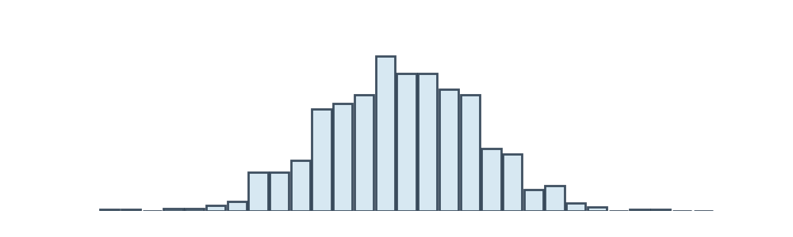

## Привет, я Екатерина!  
Аналитик с переходом из бухгалтерии: из интереса к автоматизации пришла к работе с данными и принятию решений на их основе.  Для меня данные — это способ рассказать понятную историю: что изменилось, почему и где есть потенциал.

 

### 🛠️ Языки и инструменты : 
<table>
        <tbody>
            <tr>
                <td>                     
                    
                           
                            
                            
                                                   
                                                        
                            
                            
                            
                            
                            
                            
                                                        
                            
                    
                    
                </td>           
                <td>
                    

                        
                    
                    
                </td>                
            </tr>
        </tbody>
    </table> 
    
 

<h3>☎️ Контакты:</h3>

<!-- Вместо MAX — любой другой бейдж из shields.io -->

 

<h3> Мои проекты 👇: </h3>

| Название проекта | Описание проекта | Стек |
| --- | --- | --- |
| [Расчёт очередей на кассах: реализация и верификация в Power Query и SQL](https://github.com/Ekaterina-DA/SQL_project) | Проект демонстрирует сквозной расчёт очередей на кассах: логика реализована параллельно в Power Query (Excel) и в SQL — результаты сопоставимы. В расчёте учитывается зависимость времени обслуживания от количества позиций в чеке и определяется число операций в очереди по часам. | Power Query (Excel) и SQL |

